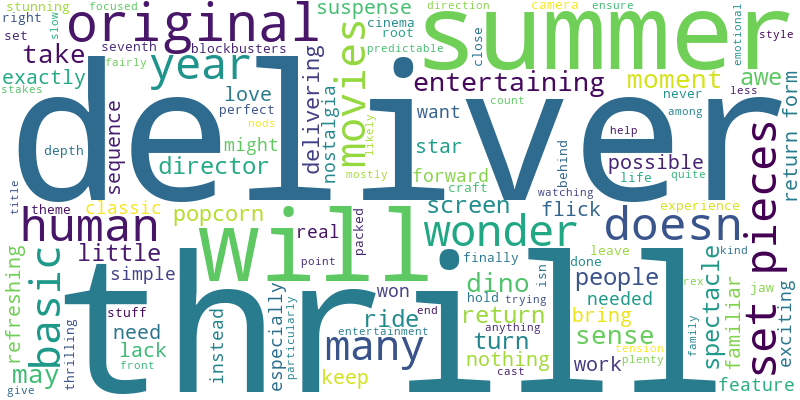
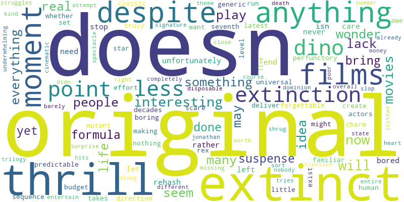
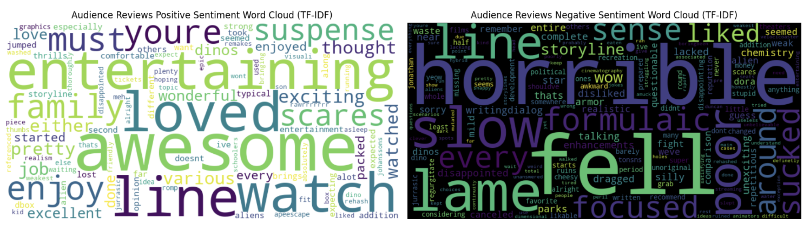

## W2M5 팀 활동

### 주제 : "특정 영화 리뷰 감성 분석 및 워드클라우드 생성 후 가치 창출"

## 1. 프로젝트 개요 및 비즈니스 가치

이 프로젝트는 Rotten Tomatoes 웹사이트에서 현재 흥행중이지만 평가가 좋지 않은 "쥬라기 월드: 새로운 시작"의 비평가 및 일반 관객의 리뷰 데이터를 수집하고, 이를 기반으로 감성 분석 및 핵심 키워드 워드클라우드를 생성하는 파이프라인을 구축합니다. 이 분석은 다음과 같은 비즈니스 가치를 제공합니다

*   **시장 및 관객 이해**: 키워드를 통해 단순히 영화가 가진 IP의 힘 외에 많은 관객을 확보할 수 있었던 이유에 대해 알아볼 수 있습니다. 이는 영화 제작사, 배급사, 마케터가 타겟 관객의 니즈를 더 정확히 이해하고, 마케팅 전략을 수립하는 데 도움을 줍니다.
*   **콘텐츠 전략 개선**: 긍정적/부정적 리뷰에서 자주 언급되는 키워드를 통해 영화의 성공 요인이나 개선이 필요한 부분을 식별할 수 있습니다. 이는 향후 콘텐츠 기획 및 제작 방향 설정에 중요한 인사이트를 제공합니다.
*   **경쟁 분석**: 유사 장르의 다른 영화에도 이 파이프라인을 적용하여 경쟁작과의 비교 분석을 수행하고, 시장 내에서 자사 영화의 위치를 파악하는 데 활용할 수 있습니다.

## 2. 프로젝트 과정

이 프로젝트는 크게 데이터 수집, 데이터 전처리 및 감성 분석, 그리고 시각화 단계로 구성됩니다.

### 2.1. 데이터 수집 (Web Scraping)

*   **목표**: Rotten Tomatoes 웹사이트에서 특정 영화의 비평가 리뷰와 관객 리뷰를 수집합니다.
*   **사용 도구**: `selenium` (웹 브라우저 자동화), `BeautifulSoup` (HTML 파싱), `requests` (HTTP 요청).
*   **스크립트**: `critics_reviews.py`, `audience_reviews.py` 비평가와 관객 리뷰를 `selenium`을 사용해 'Load More' 버튼을 자동으로 클릭해 스크래핑합니다.

### 2.2. 데이터 전처리 및 감성 분석
*   **목표**: 수집된 리뷰 텍스트를 정제하고, 감성 분석을 진행합니다.
*   **사용 도구**: `pandas` (데이터 처리), `re` (정규 표현식), `nltk` (자연어 처리)
*   **스크립트**:
    *   **텍스트 정제**: URL, 멘션(@), 해시태그(#), 숫자, 구두점 및 특수 문자를 제거합니다. 모든 텍스트는 소문자로 변환됩니다.
        *   **토큰화 및 불용어 제거**: 텍스트를 단어 단위로 분리(토큰화)하고, 일반적인 영어 불용어와 영화 리뷰에 특화된 불용어(예: 'movie', 'film', 'jurassic', 'world', 'spielberg' 등)를 제거합니다. 2글자 이하의 짧은 단어도 제거됩니다.
     
 

### 2.3. TF-IDF 기반

*   **방법론 개선**: 초기 프로젝트에서는 단순히 단어의 빈도수만을 기반으로 워드클라우드를 생성하여 감성 분석을 시도했습니다. 그러나 이 방식으로는 'ever', 'much', 'watch'과 같이 리뷰에 자주 등장하지만 실제 감성이나 영화의 특징을 나타내지 않는 의미 없는 단어들이 워드클라우드의 대부분을 차지하는 문제가 발생했습니다. 이러한 한계를 극복하고 리뷰의 핵심적인 내용을 더 정확하게 파악하기 위해, **TF-IDF(Term Frequency-Inverse Document Frequency)** 기반의 분석으로 방법론을 개선해 단순 빈도수로는 파악하기 어려운 핵심 키워드를 효과적으로 추출할 수 있게 했습니다.
*   **목표**: TF-IDF(Term Frequency-Inverse Document Frequency)를 사용하여 각 단어의 중요도를 계산해 가치를 창출 할 수 있는 Word Cloud를 생성합니다.
*   **사용 도구**: `sklearn.feature_extraction.text.TfidfVectorizer` (TF-IDF 계산)
*   **스크립트**: 
    *   `sentiment_wordcloud_analysis(TF-IDF).py`: 이 스크립트는 다음을 추가적으로 수행합니다:
        *   **TF-IDF 계산**: 전처리된 텍스트를 기반으로 TF-IDF 점수를 계산하여 각 단어의 중요도를 측정합니다.

### 2.4. 시각화 (Word Cloud)

*   **목표**: TF-IDF 점수가 높은 단어들을 사용하여 긍정 및 부정 감성에 대한 워드클라우드를 생성하여 시각적인 인사이트를 제공합니다.
*   **사용 도구**: `matplotlib.pyplot` (플롯 생성), `wordcloud` (워드클라우드 생성).
*   **스크립트**: 
    *   `sentiment_wordcloud_analysis(TF-IDF).py`: 이 스크립트에서 TF-IDF 계산 후, 긍정 리뷰와 부정 리뷰 각각에 대한 워드클라우드를 생성하고 PNG 이미지 파일로 저장합니다.
 
## 3. 워드클라우드 분석을 통한 비즈니스 가치 창출

제공된 워드클라우드를 기반으로 영화 제작사에 제공할 수 있는 비즈니스 가치와 인사이트는 다음과 같습니다.

### 3.1. 관객 리뷰 워드클라우드 분석

*   **긍정 키워드 인사이트**: 관객들은 영화의 **오락성, 스릴, 가족과 함께 즐길 수 있는 요소**에 크게 만족하고 있음을 보여줍니다.

*   **부정 키워드 인사이트**: 관객들은 영화의 **지루함(`slow`), 실망감(`lame`, `fell`), 그리고 스토리 및 플롯의 약점**에 대해 불만을 표출하고 있습니다. `nothing`은 영화에서 특별한 것을 찾지 못했다는 의미로 해석될 수 있습니다.

### 3.2. 비평가 리뷰 워드클라우드 분석

*   **긍정 키워드 인사이트**: 비평가들은 영화의 **전반적인 완성도(`superior`), 여름 시즌 영화로서의 적합성(`summer`), 그리고 즐길 만한 요소(`enjoy`, `nice`)**를 긍정적으로 평가하고 있습니다. `stuff`, `showed`, `well`은 특정 장면이나 연출에 대한 긍정적인 평가일 수 있습니다.

*   **부정 키워드 인사이트**: 비평가들은 영화의 **과장됨(`bombastic`), 진부함(`generic`), 불필요한 대화(`talking`), 그리고 전반적인 실망감(`otherwise`, `close`)**을 지적하고 있습니다. 특히 `trailerful`은 예고편에서 모든 것을 보여주어 본편의 신선함이 없다는 비판으로 해석될 수 있습니다.

## 4. 결론

| 구분 | 관객 (Audience) | 비평가 (Critic) |
| :--- | :--- | :--- |
| **긍정적 평가** | 오락성, 스릴, 가족 친화적 요소, 재관람/추천 의사 | 전반적인 완성도, 여름 시즌 영화로서의 적합성, 특정 장면/연출 |
| **부정적 평가** | 지루함, 실망감, 스토리/플롯의 약점 | 과장됨, 진부함, 불필요한 대화, 예고편 스포일러 |

*   **인사이트**: 관객은 영화의 **체험적이고 감성적인 측면(오락성, 스릴, 가족)**에 더 집중하는 반면, 비평가는 **영화의 구조적이고 예술적인 측면(완성도, 진부함, 플롯)**에 더 비판적인 경향을 보입니다.

*   **영화 제작사를 위한 전략적 제언**:
    1.  **마케팅 전략 다각화**: 
        *   **관객 대상**: 영화의 **오락성, 스릴, 가족과 함께 즐길 수 있는 경험**을 강조하는 마케팅 캠페인을 강화합니다. 예고편이나 광고에서 액션 시퀀스, 긴장감 넘치는 장면, 가족 간의 유대감을 보여주는 장면을 부각시킵니다.
        *   **비평가 대상**: 영화의 **예술적 완성도, 독창적인 연출, 메시지** 등 비평가들이 중요하게 생각하는 요소를 어필하는 보도자료나 시사회 전략을 수립합니다.
    2.  **스토리 및 플롯 개선**: 관객과 비평가 모두 스토리/플롯의 약점을 지적하고 있으므로, 후속작 기획 시 **내러티브의 깊이와 개연성**을 강화하는 데 집중해야 합니다. 특히 `trailerful`과 같은 비평은 예고편 제작 시 영화의 핵심적인 반전이나 중요한 장면을 과도하게 노출하지 않도록 하거나 예고편에서 볼 수 없던 예측 불가능하고 흥미로운 장면을 본편에 넣도록 해야합니다.
    3.  **불필요한 요소 제거**: 비평가들이 지적한 `talking` (불필요한 대화)과 같은 요소는 편집 과정에서 과감하게 줄여 영화의 몰입도를 높일 필요가 있습니다.
    4.  **타겟 관객 맞춤형 콘텐츠**: 관객이 `family` 키워드를 긍정적으로 평가한 점을 고려하여, 가족 단위 관객을 위한 프로모션이나 콘텐츠를 추가적으로 고려할 수 있습니다.

이러한 분석을 통해 영화 제작사는 영화의 강점을 극대화하고 약점을 보완하여 더 많은 관객과 비평가에게 긍정적인 평가를 받을 수 있는 전략을 수립할 수 있습니다.

## W2M6 팀 활동

### 1. Docker를 사용하는 이유가 뭘까요?

*   **환경 일관성**: "내 컴퓨터에서는 되는데 왜 서버에서는 안 되지?"와 같은 문제를 해결합니다. 개발, 테스트, 운영 환경을 Docker 이미지로 동일하게 유지하여 애플리케이션이 어디서든 동일하게 작동하도록 보장합니다.
*   **격리**: 애플리케이션과 그 종속성을 호스트 시스템으로부터 격리하여, 다른 애플리케이션과의 충돌을 방지하고 보안을 강화합니다.
*   **빠른 배포 및 확장**: 컨테이너는 가볍고 빠르게 시작되며, 이미지를 통해 쉽게 복제하고 확장할 수 있어 CI/CD 파이프라인에 통합하기 용이합니다.
*   **자원 효율성**: 가상 머신(VM)보다 훨씬 가볍고 자원 소모가 적습니다. 호스트 OS의 커널을 공유하여 오버헤드가 적습니다.
*   **버전 관리**: Docker 이미지는 버전 관리가 가능하여 특정 시점의 애플리케이션 상태를 쉽게 되돌리거나 배포할 수 있습니다.

### 2. 어떤 점은 더 불편한가요?

*   **초기 학습 곡선**: Docker 개념을 이해하는 데 시간이 필요합니다.
*   **데이터 영속성 관리**: 컨테이너가 삭제되면 내부 데이터도 사라지므로, 중요한 데이터는 볼륨을 사용하여 별도로 관리해야 합니다.
*   **복잡한 애플리케이션 관리**: 여러 컨테이너가 상호 작용하는 복잡한 애플리케이션의 경우, Docker Compose나 오케스트레이션 도구의 학습 및 설정이 필요합니다
*   **보안 고려 사항**: 컨테이너는 호스트 OS의 커널을 공유하므로, 컨테이너 내의 취약점이 호스트에 영향을 미칠 수 있습니다. 이미지 보안 스캔, 최소 권한 원칙 등을 준수해야 합니다.

### 3. 이번 미션에서는 하나의 EC2에 하나의 Docker container를 배포했습니다. 만약에 여러 대의 EC2에 여러 개의 컨테이너를 배포해야 한다면 어떻게 해야 할까요?

여러 대의 EC2 인스턴스에 여러 개의 컨테이너를 배포하고 관리하는 것을 컨테이너 오케스트레이션이라고 합니다. 이를 위해 다음과 같은 도구와 서비스를 사용할 수 있습니다:

*   **Kubernetes (k8s)**:
    *   가장 널리 사용되고 강력한 컨테이너 오케스트레이션 플랫폼입니다.
    *   컨테이너 배포, 스케일링, 로드 밸런싱, 자가 치유, 서비스 디스커버리 등 복잡한 기능을 제공합니다.
    *   AWS에서는 관리형 Kubernetes 서비스인 Amazon EKS (Elastic Kubernetes Service)를 제공합니다.
*   **Docker Swarm**:
    *   Docker 자체에 내장된 컨테이너 오케스트레이션 도구입니다.
    *   Kubernetes보다 설정이 간단하고 배우기 쉽지만, 기능은 상대적으로 제한적입니다. 소규모 프로젝트나 Docker 생태계에 익숙한 팀에 적합합니다.
*   **AWS ECS (Elastic Container Service)**:
    *   AWS에서 제공하는 완전 관리형 컨테이너 오케스트레이션 서비스입니다.
    *   AWS의 다른 서비스(VPC, IAM, CloudWatch 등)와 긴밀하게 통합되어 있어 AWS 환경에서 컨테이너를 배포하고 관리하기에 용이합니다.
    *   Fargate를 사용하면 서버를 직접 관리할 필요 없이 컨테이너를 실행할 수 있습니다.
*   **CI/CD 파이프라인 통합**:
    *   GitHub Actions, GitLab CI/CD, Jenkins, AWS CodePipeline 등과 같은 CI/CD 도구를 사용하여 코드 변경이 발생할 때마다 자동으로 Docker 이미지를 빌드하고, ECR에 푸시하며, 오케스트레이션 도구를 통해 EC2 인스턴스에 배포하는 과정을 자동화할 수 있습니다.
